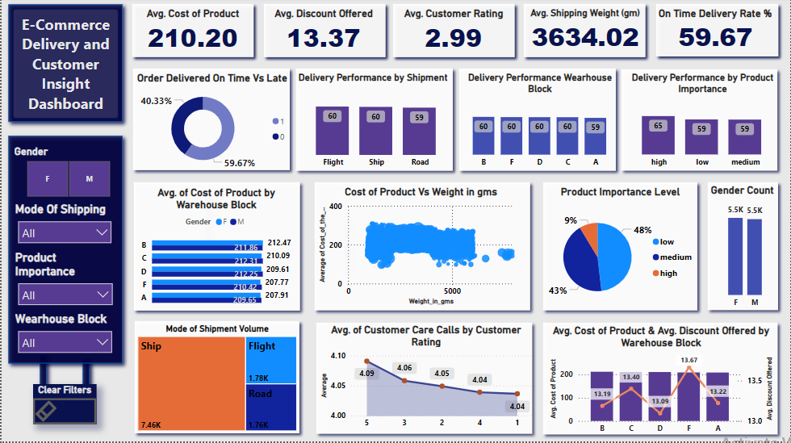

# 📦  E-Commerce Delivery and Customer Insight Dashboard

This project showcases a Power BI dashboard designed to provide deep insights into **e-commerce product delivery performance**, **customer satisfaction**, and **logistics efficiency**. The visualizations help in identifying patterns across shipping methods, customer ratings, product attributes, and warehouse operations.

---

## 📊 Dashboard Summary

The **E-Commerce Delivery and Customer Insight Dashboard** highlights:

### 🔹 Key Metrics
- **Average Cost of Product**: \$210.20  
- **Average Discount Offered**: 13.37%  
- **Average Customer Rating**: 2.99  
- **Average Shipping Weight**: 3634.02 gm  
- **On-Time Delivery Rate**: 59.67%

---

### 🔹 Analytical Insights
- **Delivery Timeliness**: Breakdown of orders delivered on time vs late.
- **Shipping Method Performance**: Insights by Flight, Ship, and Road.
- **Warehouse Efficiency**: Delivery performance and product costs by warehouse block (A–F).
- **Product Importance Levels**: Distribution and impact on delivery.
- **Customer Gender Analysis**: Equal distribution of male and female customers.
- **Cost vs Weight Correlation**: Visual analysis of product cost based on weight.
- **Customer Support Metrics**: Correlation between product rating and support calls.

---

## 🖼️ Dashboard Screenshot

---

## 🛠️ Tools & Technologies Used

- **Power BI** – Data modeling, visualization, and interactive reporting
- **DAX** – For calculated measures and KPIs
- **Excel/CSV** – As the data source

---

