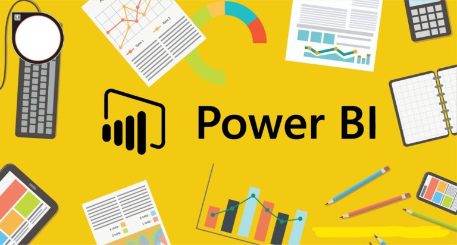

# 📊 Power BI Projects

Welcome to the **Power BI Projects** repository! This collection showcases interactive dashboards built using Power BI to solve real-world business problems in different domains such as **banking** and **e-commerce**.

---

## 💳 Project 1: Cardholder Spend & Engagement Dashboard

This dashboard analyzes credit card customer behavior and performance metrics, helping financial institutions track KPIs, acquisition costs, and customer insights.

### 🔍 Key Highlights:
- **Total Customers**: 10.11K
- **Total Transactions**: 656K
- **Total Transaction Amount**: 45M
- **Avg. Annual Fees**: \$291.85
- **Avg. Customer Acquisition Cost**: \$96.25
- **Avg. Income of Customer**: \$56.98K

### 📊 Insights Include:
- Customer demographics: gender, education, marital status
- Card category usage and expense types
- Annual fees and interest earned by card type
- Monthly and age-based transaction trends
- Income distribution by job type

---

## 📦 Project 2: E-Commerce Delivery and Customer Insight Dashboard

This dashboard provides end-to-end visibility into the delivery performance and customer satisfaction metrics for an e-commerce company.

### 🔍 Key Highlights:
- **Avg. Cost of Product**: \$210.20
- **Avg. Discount Offered**: 13.37%
- **Avg. Customer Rating**: 2.99
- **Avg. Shipping Weight**: 3634.02 gm
- **On-Time Delivery Rate**: 59.67%

### 📊 Insights Include:
- Delivery timeliness by shipping method
- Product cost by warehouse block
- Customer rating vs support calls
- Cost vs weight analysis
- Gender and product importance segmentation

---

## 🛠️ Tools Used

- Power BI (for data modeling & visualization)
- DAX (for calculated fields and KPIs)
- Excel/CSV as data sources

---

## 🚀 How to Use

1. Clone this repository:
   ```bash
   git clone https://github.com/NikhilNikhare151/power-bi-projects.git


